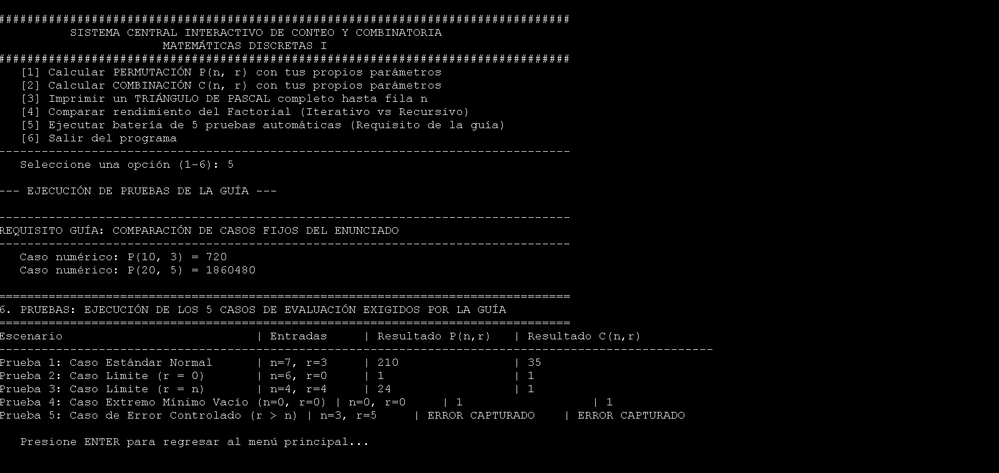
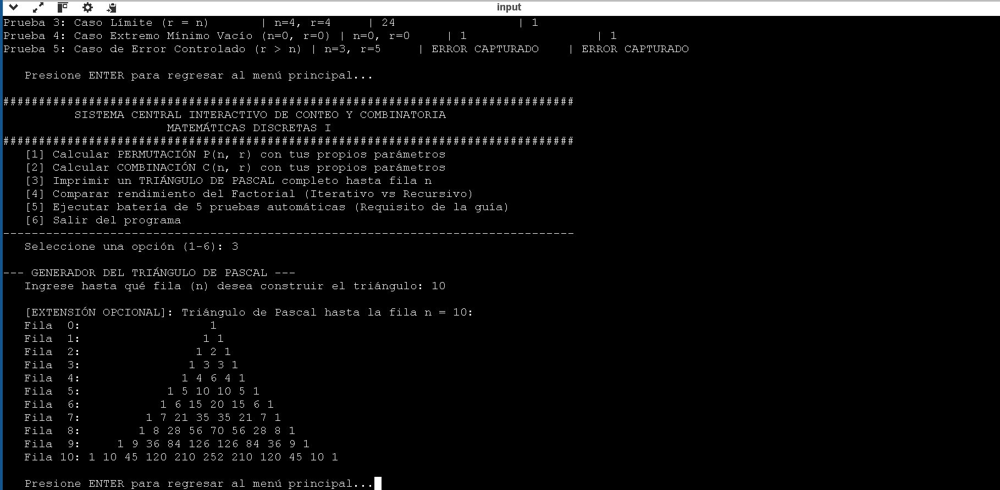
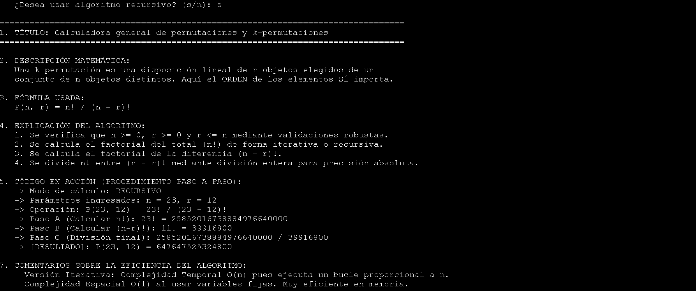
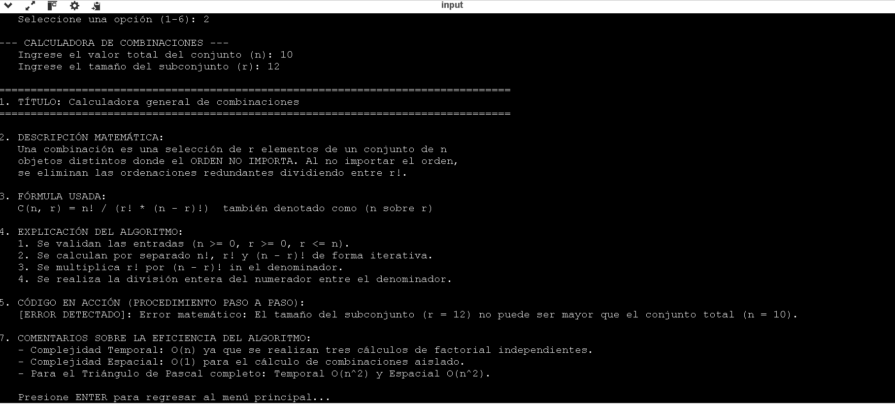
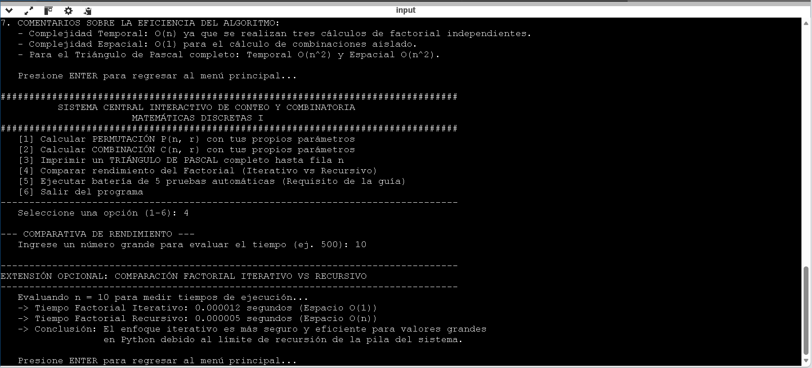

# Bono programable 1 
#### Matemáticas Discretas I
#### Universidad Nacional de Colombia
#### Docente: Jhoan Sebastian Tenjo García
#### Estudiante: Oscar Andres Andrade Medina

---

## 1. Introducción

Este trabajo contiene el diseño, modelado e implementación en software de dos problemas fundamentales de la combinatoria enumerativa seleccionados de la guía de bonificación: las $k$-permutaciones y las combinaciones sin repetición. El objetivo principal de este desarrollo es construir una herramienta parametrizable e interactiva en Python que permita validar los modelos teóricos discutidos en clase y evaluar su comportamiento numérico ante múltiples escenarios de entrada.

---

## 2. Modelado Matemático y Sustentación Teórica

### 2.1. Problema 1: Calculadora General de Permutaciones y $k$-Permutaciones
Una $k$-permutación modela el número de formas de construir secuencias lineales ordenadas de tamaño $r$ a partir de un conjunto con $n$ elementos distintos. En este modelo, el orden de los componentes altera el resultado final del conteo (por ejemplo, la secuencia $AB$ es distinta de $BA$).

* **Fórmula utilizada:**
    $$P(n, r) = \frac{n!}{(n - r)!}$$
* **Condiciones de frontera:** El modelo exige que $n$ y $r$ sean enteros no negativos ($n, r \ge 0$) y que el tamaño del subconjunto no supere la cardinalidad del conjunto total ($r \le n$). Cuando $n = r$, el problema se reduce a una permutación total ($P(n, n) = n!$), apoyándose en la definición axiomática de $0! = 1$.

### 2.2. Problema 2: Calculadora General de Combinaciones
Una combinación sin repetición modela la selección de un subconjunto de tamaño $r$ extraído de un conjunto global de $n$ elementos, con la restricción de que **el orden no importa**. Debido a que las ordenaciones internas de los elementos seleccionados son redundantes, se divide el total de permutaciones entre el factorial del subconjunto ($r!$) para neutralizar el efecto del orden.

* **Fórmula utilizada:**
    $$C(n, r) = \binom{n}{r} = \frac{n!}{r!(n - r)!}$$
* **Identidad de Simetría:** El programa verifica automáticamente que $\binom{n}{r} = \binom{n}{n-r}$. Matemáticamente, esto se fundamenta en que elegir $r$ elementos para formar un grupo es equivalente a elegir los $n - r$ elementos que se van a excluir de dicho grupo.
* **Relación con el Triángulo de Pascal:** Los coeficientes de la fila $n$ del Triángulo de Pascal corresponden exactamente a los valores de $\binom{n}{k}$ para cada $k$ desde $0$ hasta $n$. Su construcción se basa en la adición sucesiva de los elementos de la fila inmediatamente anterior.

---

## 3. Lógica del Algoritmo y Eficiencia Computacional

Para garantizar la precisión absoluta en números grandes, todas las divisiones de las fórmulas se implementaron utilizando el operador de división entera (`//`), evitando así los errores de redondeo nativos del tipo de dato *float*.

### 3.1. Algoritmos para la Función Factorial
Se implementaron dos estrategias funcionales para el cálculo de $n!$, permitiendo contrastar su comportamiento computacional:

1.  **Enfoque Iterativo:** Resuelve el cálculo mediante un ciclo acumulativo lineal (`for`).
    * *Complejidad Temporal:* $\mathcal{O}(n)$, debido a que ejecuta exactamente $n-1$ multiplicaciones.
    * *Complejidad Espacial:* $\mathcal{O}(1)$, ya que el uso de memoria es constante y no depende del tamaño de la entrada.
2.  **Enfoque Recursivo:** Aplica la definición inductiva del problema, donde la función se llama a sí misma decrecientemente hasta alcanzar el caso base ($n=0$ o $n=1$).
    * *Complejidad Temporal:* $\mathcal{O}(n)$, requiriendo $n$ pasos secuenciales.
    * *Complejidad Espacial:* $\mathcal{O}(n)$, debido a que cada llamada se acumula en la pila de ejecución del sistema (*call stack*). Esto genera limitaciones físicas en entornos computacionales reales, provocando errores de desbordamiento (`RecursionError`) con valores grandes de $n$.

### 3.2. Estructura del Triángulo de Pascal
Para generar el triángulo completo, se diseñó una matriz dinámica que almacena vectorizadamente las filas calculadas. La complejidad temporal y espacial para renderizar la estructura completa hasta una fila $n$ es de $\mathcal{O}(n^2)$.

---

## 4. Manual de Operación e Instrucciones de Ejecución

### 4.1. Requisitos de Entorno
* Contar con un intérprete de **Python 3.8** o superior instalado.
* El programa fue desarrollado utilizando exclusivamente la biblioteca estándar de Python (módulo `time` para la medición de rendimiento), por lo cual **no requiere la instalación de dependencias externas ni librerías adicionales**.

### 4.2. Instrucciones para Ejecutar el Programa
1.  Descargue el archivo de código fuente `main.py` o clone este repositorio en su máquina local.
2.  Abra una terminal de comandos y desplácese hasta el directorio donde se encuentra el archivo.
3.  Ejecute el programa mediante el comando:
    ```bash
    python main.py
    ```
4.  Interactúe con el menú en consola ingresando el número de la opción deseada y digitando los parámetros solicitados.

---

## 5. Validación de Entradas y Manejo de Errores

El programa cuenta con un módulo de validación robusto (`validar_entradas`) diseñado para evitar que operaciones matemáticamente inválidas detengan la ejecución de forma abrupta. El control se gestiona bajo los siguientes criterios:

* **Validación de Tipo (`TypeError`):** Si el usuario ingresa datos que no correspondan a números enteros (como texto o decimales), la interfaz captura el error y solicita una nueva entrada.
* **Validación de Valores Negativos (`ValueError`):** Se restringe el ingreso de valores menores a cero, evitando la indeterminación de la función factorial.
* **Validación de Frontera (`ValueError`):** Si se detecta un escenario donde el subconjunto supera al conjunto total ($r > n$), el sistema intercepta la operación y despliega un mensaje explicativo informando la inconsistencia matemática del caso.

---

## 6. Matriz de Pruebas Ejecutadas

Para verificar la estabilidad y robustez del software, la opción 5 del menú ejecuta automáticamente la batería de pruebas exigida por la cátedra, evaluando casos normales, límites y de manejo de errores:

| Prueba | Tipo de Escenario | Parámetros ($n, r$) | Justificación y Comportamiento Esperado |
| :--- | :--- | :--- | :--- |
| **Prueba 1** | Caso Estándar Normal | $n = 7, r = 3$ | Verifica el comportamiento cotidiano del modelo combinatorio. Resultados: $P(7,3)=210$, $C(7,3)=35$. |
| **Prueba 2** | Caso Límite ($r = 0$) | $n = 6, r = 0$ | Comprueba que seleccionar ningún objeto devuelva exactamente $1$ (el conjunto vacío), según el comportamiento axiomático. |
| **Prueba 3** | Caso Límite ($r = n$) | $n = 4, r = 4$ | Evalúa la operación de división frente a un factorial de cero ($0!$) en el denominador, validando que el resultado sea correcto. |
| **Prueba 4** | Caso Extremo Mínimo | $n = 0, r = 0$ | Analiza el comportamiento del software en el límite inferior absoluto del vacío ($0! / (0! \times 0!)$). |
| **Prueba 5** | Error Controlado | $n = 3, r = 5$ | Evalúa la respuesta ante parámetros ilógicos ($r > n$). El validador intercepta la entrada, muestra el mensaje de error y evita el cálculo inválido. |

Adicionalmente, el programa incluye un módulo específico que calcula y compara de forma directa los casos del enunciado: $P(10,3)$ y $P(20,5)$.

---

## 4. Manual de Operación e Instrucciones de Ejecución

### 4.1. Requisitos de Entorno
* Contar con un intérprete de **Python 3.8** o superior instalado en caso de ejecución local.
* El programa fue desarrollado utilizando exclusivamente la biblioteca estándar de Python (módulo `time` para la medición de rendimiento), por lo cual **no requiere la instalación de dependencias externas ni librerías adicionales**.

### 4.2. Alternativa de Ejecución Rápida en la Nube (Recomendado)
Para agilizar la revisión y omitir la configuración en un entorno local, el código puede ejecutarse directamente desde el navegador web mediante un compilador en línea:
1. Copie la totalidad del código fuente contenido en el archivo `main.py` de este repositorio.
2. Acceda a un ejecutor gratuito de Python en línea (como por ejemplo: [Online-Python.com](https://www.online-python.com/) o [Replit.com](https://replit.com/)).
3. Pegue el código en el editor web y presione el botón **Run** (Ejecutar). 
4. La consola interactiva se desplegará en la misma página para interactuar con el menú.

### 4.3. Instrucciones para Ejecución Local
1. Descargue el archivo de código fuente `main.py` o clone este repositorio en su máquina local.
2. Abra una terminal de comandos y desplácese hasta el directorio donde se encuentra el archivo.
3. Ejecute el programa mediante el comando:
   ```bash
   python main.py


### Evidencias de Ejecución en Consola

A continuación se adjuntan las capturas de pantalla que demuestran el correcto funcionamiento del sistema interactivo y el cumplimiento de la batería de pruebas:








